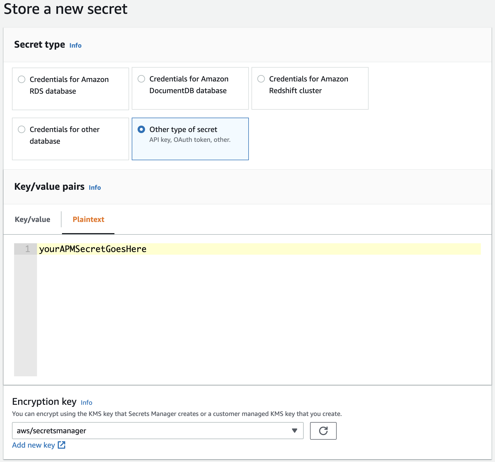

---
mapped_pages:
  - https://www.elastic.co/guide/en/apm/lambda/current/aws-lambda-secrets-manager.html
---

# Using AWS Secrets Manager to manage APM authentication keys [aws-lambda-secrets-manager]

When using the config options [`ELASTIC_APM_SECRET_TOKEN` or `ELASTIC_APM_API_KEY`](/reference/aws-lambda-config-options.md#aws-lambda-config-authentication-keys) for authentication of the {{apm-lambda-ext}}, the corresponding keys are specified in plain text in the environment variables of your Lambda function. If you prefer to securely store the authentication keys, you can use the AWS Secrets Manager and let the extension retrieve the actual keys from the AWS Secrets Manager. Follow the instructions below to set up the AWS Secrets Manager with the extension.


## Step 1: Create a secret in the AWS Secrets Manager. [aws-lambda-secrets-manager-create-secret]

[Create a secret in the AWS Secrets Manager](https://docs.aws.amazon.com/secretsmanager/latest/userguide/create_secret.html) for the [APM Secret Token](docs-content://solutions/observability/apps/secret-token.md) or the [APM API key](docs-content://solutions/observability/apps/api-keys.md), depending on which one you prefer to use. Make sure to create the secret as a **Plaintext** typed secret and ensure it is created **in the same AWS region** as your target Lambda function that will use the secret.

We recommend using the AWS-managed encryption key `aws/secretsmanager`. However, you can optionally create and select a custom KMS key for encryption. Note that with a custom encryption key, you will need additional key permissions on your Lambda function (see [Step 2](#aws-lambda-secrets-manager-permissions)).

:::::::{tab-set}

::::::{tab-item} AWS Web Console
In the Web Console of the AWS Secrets Manager, navigate to `Store a new secret`, select `Other type of secret` as the secret type, and choose the `Plaintext` tab for entering the secret value. Enter your APM secret token or APM API key value as a plain string (**not** as a JSON key value pair).



Click `Next`, choose a secret name, and finalize the creation of the secret.
::::::

::::::{tab-item} AWS CLI
Execute the following command to create a secret in the AWS Secrets Manager for your APM secret token or the APM API key:

```bash
aws secretsmanager create-secret \
    --name MyAPMSecretToken \  <1>
    --description "The Elastic APM secret token." \
    --secret-string "YOUR_APM_AUTHENTICATION_KEY" <2>
```

1. Choose a secret name
2. APM secret token or APM API key
::::::

::::::{tab-item} SAM
The AWS Serverless Application Model (SAM) does not provide means to create a secret in the AWS Secrets Manager. Use one of the other options to create the secret.
::::::

::::::{tab-item} Serverless
The Serverless Framework does not provide means to create a secret in the AWS Secrets Manager. Use one of the other options to create the secret.
::::::

::::::{tab-item} Terraform
Add the following resources to your terraform file to create a secret in the AWS Secrets Manager for your APM secret token or the APM API key:

```yaml
...
resource "aws_secretsmanager_secret" "apm_secret_token" {
   name = "MyAPMSecretToken" <1>
}

resource "aws_secretsmanager_secret_version" "apm_secret_token_version" {
  secret_id = aws_secretsmanager_secret.apm_secret_token.id
  secret_string = "YOUR_APM_AUTHENTICATION_KEY" <2>
}
...
```

1. Choose a secret name
2. APM secret token or APM API key
::::::

:::::::
Remember your chosen secret name. You will use the secret name as the value for the config options [`ELASTIC_APM_SECRETS_MANAGER_SECRET_TOKEN_ID` or `ELASTIC_APM_SECRETS_MANAGER_API_KEY_ID`](/reference/aws-lambda-config-options.md#aws-lambda-config-secrets-manager-options) when configuring your {{apm-lambda-ext}}.


## Step 2: Add permissions to your AWS Lambda function [aws-lambda-secrets-manager-permissions]

For your Lambda function to be able to retrieve the authentication key from the AWS Secrets Manager, you need to provide the following permissions to your Lambda function.

:::::::{tab-set}

::::::{tab-item} AWS Web Console
* In the Web Console of your AWS Lambda function navigate to `Configuration` → `Permissions` and click on the link in the `Execution Role` section. This will lead you to the Web Console for the corresponding IAM role.
* Select `Create inline policy` in the `Add permission` dropdown button and select the `JSON` tab to define the following JSON-based policy:

    ```json
    {
        "Version": "2012-10-17",
        "Statement": [
            {
                "Effect": "Allow",
                "Action": [
                    "secretsmanager:GetSecretValue"
                ],
                "Resource": [
                    "THE_ARN_OF_YOUR_SECRET"
                ]
            },
            { <1>
                "Effect": "Allow",
                "Action": [
                    "kms:Decrypt"
                ],
                "Resource": [
                    "THE_ARN_OF_YOUR_CUSTOM_KMS_KEY"
                ]
            }
        ]
    }
    ```

    1. This permission is ONLY needed if you use a custom KMS encryption key for your secret

* Review and save the policy.
::::::

::::::{tab-item} AWS CLI
* Create a policy file (`smElasticApmPolicy.json`) with the following content:

    ```json
    {
        "Version": "2012-10-17",
        "Statement": [
            {
                "Effect": "Allow",
                "Action": [
                    "secretsmanager:GetSecretValue"
                ],
                "Resource": [
                    "THE_ARN_OF_YOUR_SECRET"
                ]
            },
            { <1>
                "Effect": "Allow",
                "Action": [
                    "kms:Decrypt"
                ],
                "Resource": [
                    "THE_ARN_OF_YOUR_CUSTOM_KMS_KEY"
                ]
            }
        ]
    }
    ```

    1. This permission is ONLY needed if you use a custom KMS encryption key for your secret

* Retrieve the execution role name of your Lambda function with the following command:

    ```bash
    aws lambda get-function-configuration --function-name THE_NAME_OF_YOUR_FUNCTION | grep "Role"
    ```

* Attach the new policy to the execution role:

    ```bash
    aws iam put-role-policy \
      --role-name NAME_OR_ARN_OF_THE_EXECUTION_ROLE \
      --policy-name SecretsManagerAPMKeyPolicy \
      --policy-document file://smElasticApmPolicy.json
    ```
::::::

::::::{tab-item} SAM
In your SAM `template.yml` file add the following policy to give the Lambda function access to the stored secret:

```yaml
...
AWSTemplateFormatVersion: '2010-09-09'
Transform: 'AWS::Serverless-2016-10-31'
Resources:
  yourLambdaFunction:
    Type: 'AWS::Serverless::Function'
    Properties:
      ...
      Policies:
      - Statement:
        - Sid: SecretsManagerGetSecretValue
          Effect: Allow
          Action:
            - secretsmanager:GetSecretValue
          Resource: 'THE_ARN_OF_YOUR_SECRET'
        - Sid: KMSDecrypt <1>
          Effect: Allow
          Action:
            - kms:Decrypt
          Resource: 'THE_ARN_OF_YOUR_CUSTOM_KMS_KEY'
...
```

1. This permission is ONLY needed if you use a custom KMS encryption key for your secret
::::::

::::::{tab-item} Serverless
In your serverless file add the following policy to give the Lambda function access to the stored secret:

```yaml
...
provider:
  iam:
    role:
      statements:
        - Effect: Allow
          Action: 'secretsmanager:GetSecretValue'
          Resource: 'THE_ARN_OF_YOUR_SECRET'
        - Effect: Allow <1>
          Action: 'kms:Decrypt'
          Resource: 'THE_ARN_OF_YOUR_CUSTOM_KMS_KEY'
...
```

1. This permission is ONLY needed if you use a custom KMS encryption key for your secret
::::::

::::::{tab-item} Terraform
Add the following policy and policy attachement resources to your terraform file to give the Lambda function access to the stored secret:

```yaml
...
resource "aws_iam_role" "lambda_role" {
  // Here is your Lambda execution role
  ...
}

resource "aws_iam_policy" "secrets_manager_elastic_apm_policy" {
  name        = "secrets_manager_elastic_apm_policy"
  description = "Allows the lambda function to access the APM authentication key stored in AWS Secrets Manager."

  policy = <<EOF
{
  "Version": "2012-10-17",
  "Statement": [
    {
      "Action": [
        "secretsmanager:GetSecretValue"
      ],
      "Effect": "Allow",
      "Resource": "THE_ARN_OF_YOUR_SECRET"
    },
    { <1>
      "Action": [
        "kms:Decrypt"
      ],
      "Effect": "Allow",
      "Resource": "THE_ARN_OF_YOUR_CUSTOM_KMS_KEY"
    }
  ]
}
EOF
}

resource "aws_iam_policy_attachment" "secrets_manager_elastic_apm_policy_attach" {
  role      = aws_iam_role.lambda_role.name
  policy_arn = aws_iam_policy.secrets_manager_elastic_apm_policy.arn
}
...
```

1. This permission is ONLY needed if you use a custom KMS encryption key for your secret
::::::

:::::::

## Step 3: Configure the {{apm-lambda-ext}} [_step_3_configure_the_apm_lambda_ext]

Finally, you will need to configure the {{apm-lambda-ext}} to use the secret from the Secrets Manager *instead of* the value provided through [`ELASTIC_APM_SECRET_TOKEN` or `ELASTIC_APM_API_KEY`](/reference/aws-lambda-config-options.md#aws-lambda-config-authentication-keys).

Provide the name of the secret you created in [Step 1](#aws-lambda-secrets-manager-create-secret) as the value for the [`ELASTIC_APM_SECRETS_MANAGER_SECRET_TOKEN_ID` or `ELASTIC_APM_SECRETS_MANAGER_API_KEY_ID`](/reference/aws-lambda-config-options.md#aws-lambda-config-secrets-manager-options) config option, respectively, depending on whether you want to use the [APM Secret Token](docs-content://solutions/observability/apps/secret-token.md) or the [APM API key](docs-content://solutions/observability/apps/api-keys.md).

The language-specific instructions describe how to set environment variables for configuring AWS Lambda for Elastic APM:

* [Configure APM on AWS Lambda - Node.js](apm-agent-nodejs://reference/lambda.md#configure_apm_on_aws_lambda)
* [Configure APM on AWS Lambda - Python](apm-agent-python://reference/lambda-support.md#configure_apm_on_aws_lambda)
* [Configure APM on AWS Lambda - Java](apm-agent-java://reference/aws-lambda.md#configure_apm_on_aws_lambda)

That’s it. With the first invocation (cold start) of your Lambda function you should see a log message from the {{apm-lambda-ext}} indicating that a secret from the secrets manager is used:

```yaml
"Using the APM secret token retrieved from Secrets Manager."
```

