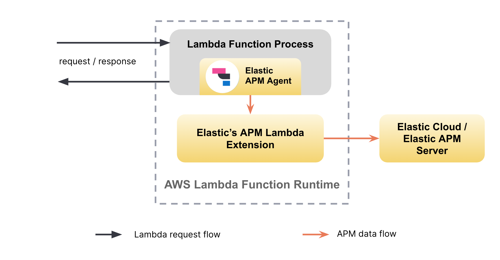

---
mapped_pages:
  - https://www.elastic.co/guide/en/apm/lambda/current/aws-lambda-arch.html
  - https://www.elastic.co/guide/en/apm/lambda/current/index.html
applies_to:
  stack:
  serverless:
    observability:
---

# APM Architecture for AWS Lambda [aws-lambda-arch]

AWS Lambda uses a special execution model to provide a scalable, on-demand compute service for code execution. In particular, AWS freezes the execution environment of a lambda function when no active requests are being processed. This execution model poses additional requirements on APM in the context of AWS Lambda functions:

1. To avoid data loss, APM data collected by APM agents needs to be flushed before the execution environment of a lambda function is frozen.
2. Flushing APM data must be fast so as not to impact the response times of lambda function requests.

To accomplish the above, Elastic APM agents instrument AWS Lambda functions and dispatch APM data via an [AWS Lambda extension](https://docs.aws.amazon.com/lambda/latest/dg/using-extensions.html).

Normally, during the execution of a Lambda function, there’s only a single language process running in the AWS Lambda execution environment. With an AWS Lambda extension, Lambda users run a *second* process alongside their main service/application process.

By using an AWS Lambda extension, Elastic APM agents can send data to a local Lambda extension process, and that process will forward data on to APM Server asynchronously. The Lambda extension ensures that any potential latency between the Lambda function and the APM Server instance will not cause latency in the request flow of the Lambda function itself.

